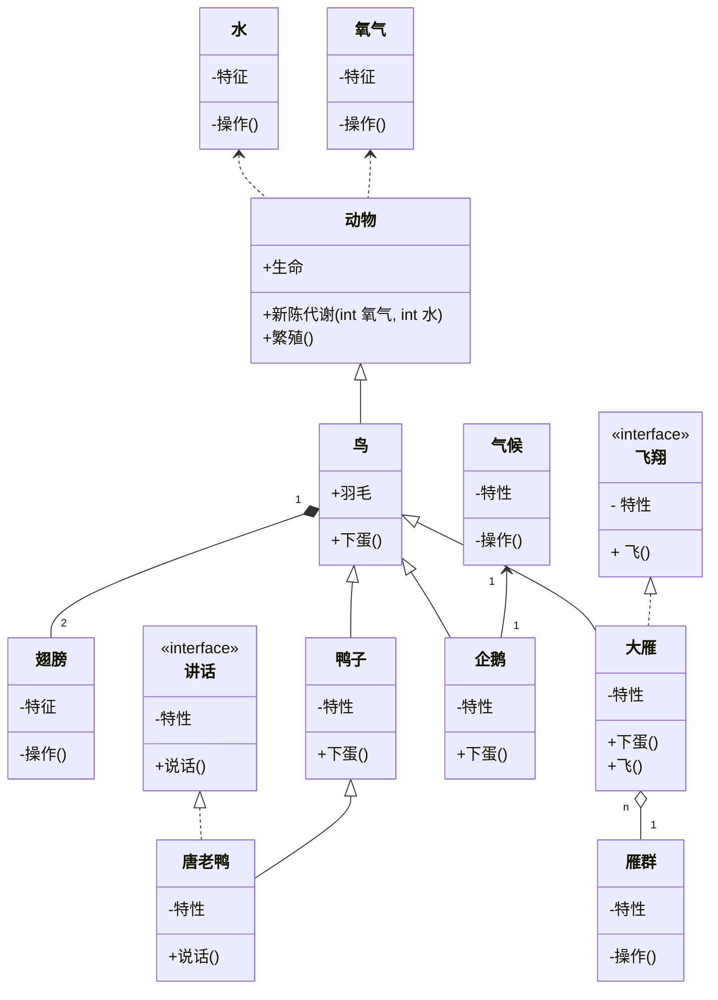

# Java 设计模式

## 遵循6个原则

1. 单一职责原则
2. 开发-封闭原则
3. 里氏代换原则
4. 依赖倒转原则
5. 迪米特原则
6. 合成/聚合复用原则

## UML类图中的几种关系

1. 泛化 Generalization
2. 实现 Realization
3. 关联 Association
4. 聚合 Aggregation
5. 组合 Composition
6. 依赖 Dependency

各种关系的强弱顺序: `泛化 = 实现 > 组合 > 聚合 > 关联 > 依赖`

举个例子:

## 创建型(5个)

1. 工厂方法
2. 抽象工厂
3. 建造者
4. 原型
5. 单例

## 结构型(7个)

1. [适配器](src/adapter/adapter.md)
2. [桥接](src/bridge/bridge.md)
3. [组合](src/composite/composite.md)
4. [装饰](src/decorator/decorator.md)
5. [外观](src/facade/facade.md)
6. [享元](src/flyweight/flyweight.md)
7. [代理](src/proxy/proxy.md)

## 行为型(11个 )

1. 解释器
2. 模板方法
3. 责任链
4. 命令
5. 迭代器
6. 中介者
7. 备忘录
8. 观察者
9. 状态
10. 策略
11. 访问者