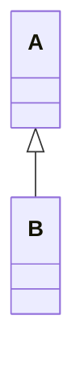
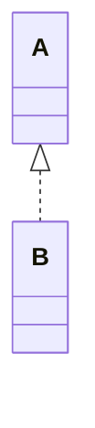
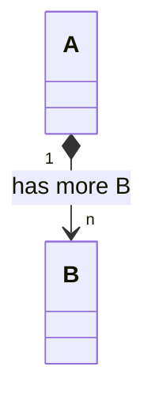
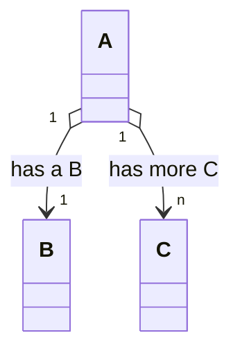
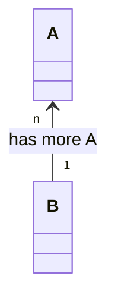
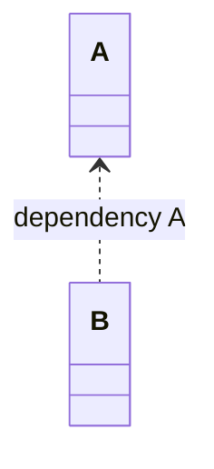
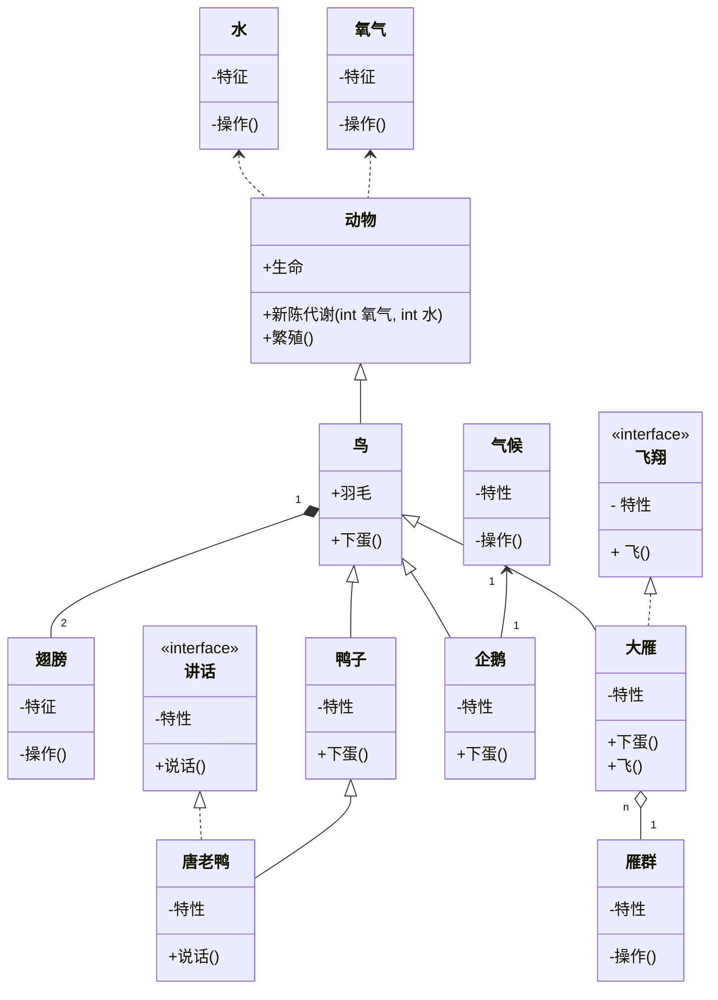
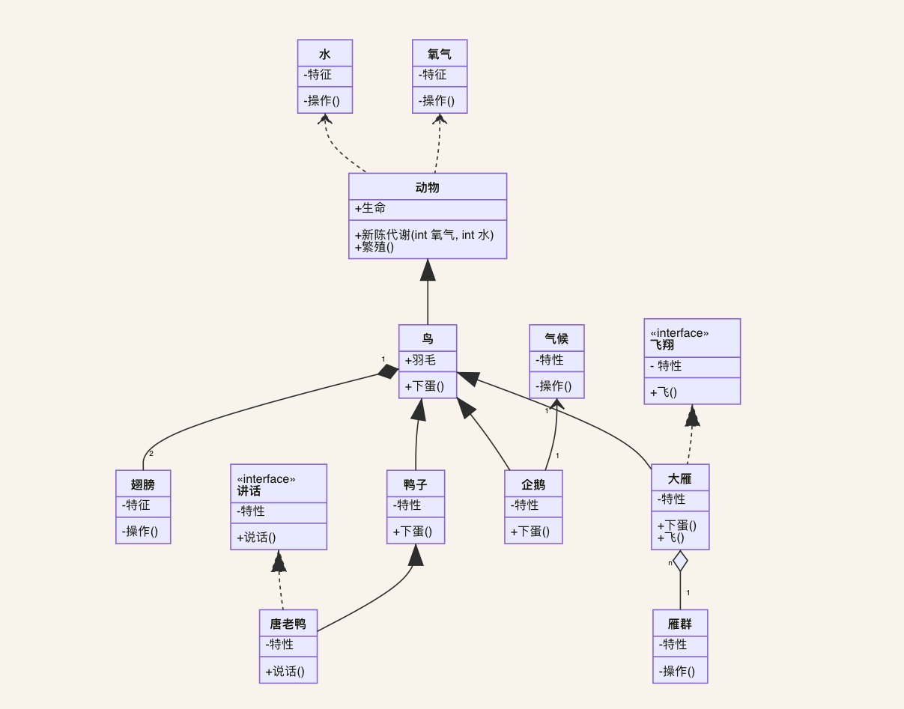

# Java 设计模式

## 遵循6个原则

1. 单一职责原则, 一个类应该只承担一个职责。承担的职责过多，职责之间可能会相互耦合。
2. 开放-封闭原则, 对扩展开放，对修改关闭。
3. 里氏代换原则, 继承父类的目的是为了复用。高质量的继承关系，是衍生类可以完全替换掉基类，并且系统的行为不受到影响。如果子类不能完全替换父类，说明继承是不彻底的，复用的目的就没有达到。
4. 依赖倒转原则, 面向接口编程，不要针对实现编程。实现意味着应对变化的能力下降，尽量延迟到调用时再具体化。
5. 迪米特原则, 一个类对依赖的类知道的越少越好。本质目的是将复杂度控制在一定范围内。
6. 合成/聚合复用原则, 复用即可以通过继承实现，也可以通过组合 / 聚合实现。区别在于，继承表达is-a的逻辑关联，目的在描述结构，而不是复用。

## UML类图中的几种关系

1. 泛化 Generalization, 是类与类之间或者接口与接口之间的继承关系。
2. 实现 Realization, 类与接口之间的关系。
3. 组合 Composition, 一种强关联，强调部分是整体不可分割的一部分，具有相同的生命周期。
4. 聚合 Aggregation, 一种组合稍弱的强关联，强调个体相对于集体的独立性，个体组成了集体，两者生命周期是独立的。
3. 关联 Association, 强调的是拥有关系，是实际存在的逻辑关联。
6. 依赖 Dependency, 一种耦合度较低的关系，这种关系一般是偶然性的、临时性的。

各种关系的强弱顺序: `泛化is-a = 实现like-a > 组合part-a > 聚合contains-a > 关联has-a > 依赖use-a`

## mermaid语法

1. 泛化

2. 实现

3. 组合

4. 聚合

5. 关联

6. 依赖

举个例子:

## 创建型(5个)

1. [工厂方法](src/factory/factory.md#工厂方法-factory-method)
2. [抽象工厂](src/factory/factory.md#抽象工厂-abstract-factory)
3. [建造者](src/builder/builder.md)
4. [原型](src/prototype/prototype.md)
5. [单例](src/singleton/singleton.md)

## 结构型(7个)

1. [适配器](src/adapter/adapter.md)
2. [桥接](src/bridge/bridge.md)
3. [组合](src/composite/composite.md)
4. [装饰](src/decorator/decorator.md)
5. [外观](src/facade/facade.md)
6. [享元](src/flyweight/flyweight.md)
7. [代理](src/proxy/proxy.md)

## 行为型(11个 )

1. [解释器](src/interpreter/interpreter.md)
2. [模板方法](src/template/template.md)
3. [责任链](src/chain/chain-of-responsibility.md)
4. [命令](src/command/command.md)
5. [迭代器](src/iterator/iterator.md)
6. [中介者](src/mediator/mediator.md)
7. [备忘录](src/memento/memento2.md)
8. [观察者](src/observer/observer.md)
9. [状态](src/state/state.md)
10. [策略](src/strategy/strategy.md)
11. 访问者