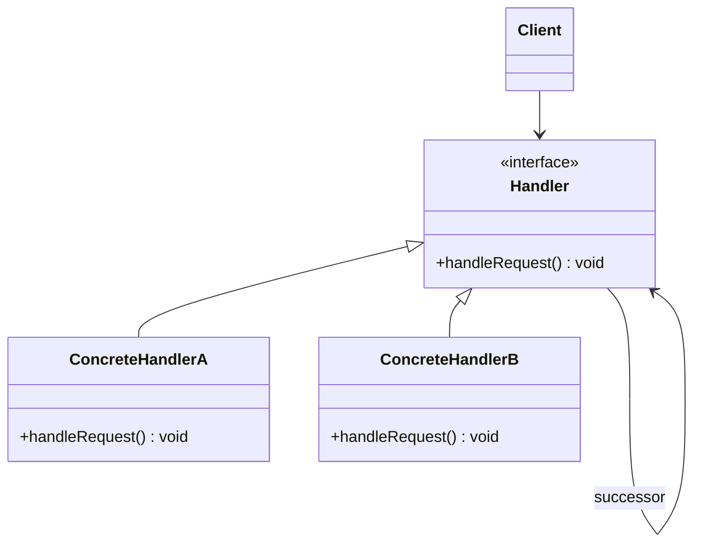

# 责任链模式 chain of responsibility

## 动机
使多个对象都有机会处理请求，从而避免请求的发送者和接收者之间的耦合关系。将这些对象连成一条链，并沿着这条链传递该请求，直到有一个对象处理它为止。

## 定义
为请求创建了一个接收者对象的链。这种模式给予请求的类型，对请求的发送者和接收者进行解耦。

## 结构
责任链模式包含如下角色:
- Handler接收处理抽象类
- ConcreteHandler接收处理具体类
- Client客户类

## 适用环境
- 职责链上的处理者负责处理请求，客户只需要将请求发送到职责链上即可，无须关心请求的处理细节和请求的传递，所以职责链将请求的发送者和请求的处理者解耦了。
