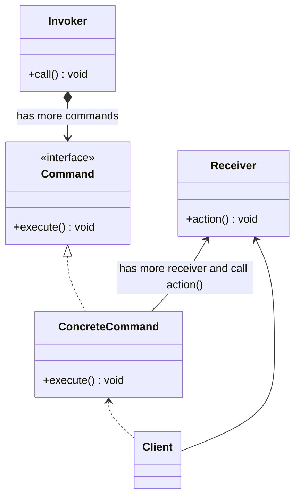

# 命令模式 command

## 动机

经常需要向某些对象发送请求，但是并不知道请求的接收者是谁，也不知道被请求的操作是哪个，我们只需在程序运行时指定具体的请求接收者即可，此时，可以使用命令模式来进行设计，使得请求发送者与请求接收者消除彼此之间的耦合，让对象之间的调用关系更加灵活。

## 定义

将一个请求封装为一个对象，从而使我们可用不同的请求对客户进行参数化；对请求排队或者记录请求日志，以及支持可撤销的操作。其别名为动作(Action)模式或事务(Transaction)模式。

## 结构

命令模式包含如下角色: 
- Command抽象命令类
- ConcreteCommand具体命令类
- Invoker调用者
- Receiver接收者
- Client客户类

## 适用环境

