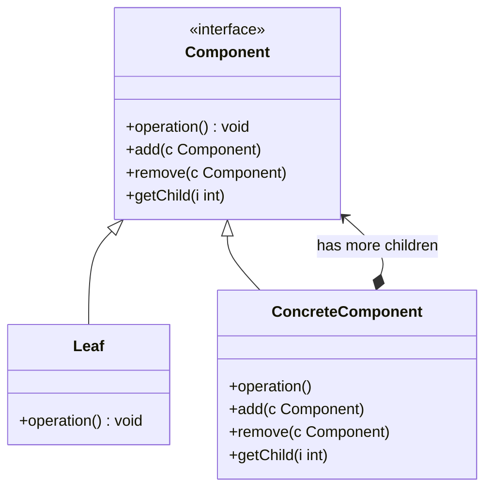
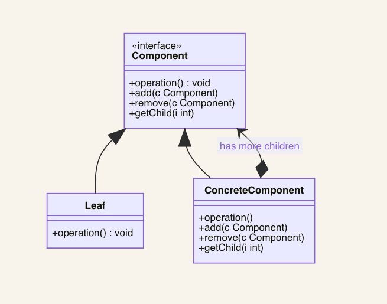

# 组合模式 composite

## 动机
- 在树型结构的问题中，模糊了简单元素和复杂元素的概念，客户程序可以像处理简单元素一样来处理复杂元素，从而使得客户程序与复杂元素的内部结构解耦。
- 将对象组合成树形结构以表示“部分-整体”的层次结构。composite组合方式使得用户对单个对象和组合对象的使用具有一致性。

## 定义
一组相似的对象当作一个单一的对象。组合模式依据树形结构来组合对象，用来表示部分以及整体层次。又叫做部分-整体模式。

## 结构
组合模式包含以下角色: Component组件抽象类、ConcreteComponent组件具体类

## 适用环境
- 想表示对象的部分-整体层次结构。
- 希望用户忽略组合对象与单个对象的不同，用户将统一地使用组合结构中的所有对象。