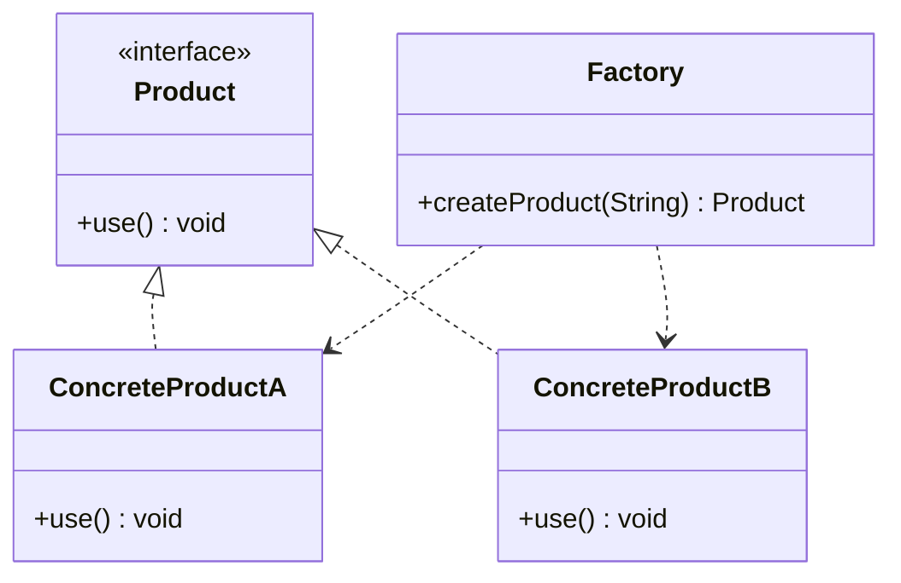
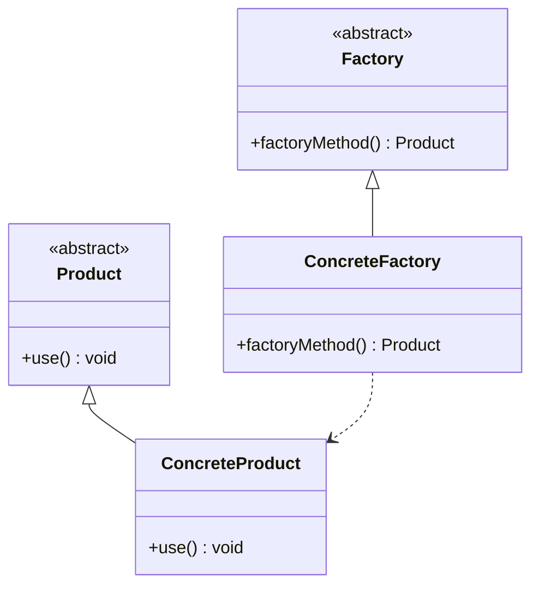
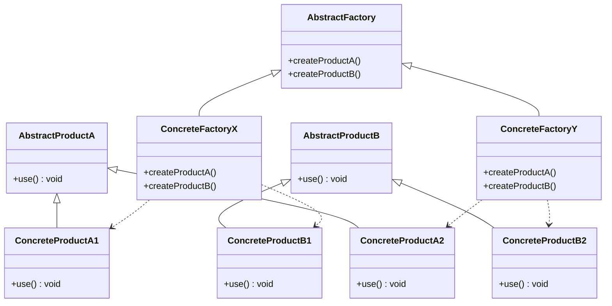

# 简单工厂模式 simple factory

## 动机

一个软件系统可以提供多个外观不同的按钮（如圆形按钮、矩形按钮、菱形按钮等），
这些按钮都源自同一个基类，不过在继承基类后不同的子类修改了部分属性从而使得它们可以呈现不同的外观，如果我们希望在使用这些按钮时，不需要知道这些具体按钮类的名字，只需要知道表示该按钮类的一个参数，并提供一个调用方便的方法，把该参数传入方法即可返回一个相应的按钮对象，此时，就可以使用简单工厂模式。

## 定义

又称为静态工厂方法(Static Factory Method)模式，它属于类创建型模式。在简单工厂模式中，可以根据参数的不同返回不同类的实例。简单工厂模式"专门定义一个类"来负责创建其他类的实例，被创建的实例通常都具有共同的父类。

## 结构

简单工厂模式包含如下角色:

- Factory工厂类
- Product抽象产品角色
- ConcreteProduct具体产品角色

## 适用环境

- 工厂类负责创建的对象比较少：由于创建的对象较少，不会造成工厂方法中的业务逻辑太过复杂。
- 客户端只知道传入工厂类的参数，对于如何创建对象不关心：客户端既不需要关心创建细节，甚至连类名都不需要记住，只需要知道类型所对应的参数。

# 工厂方法 factory method

## 动机

将具体按钮的创建过程交给专门的工厂子类去完成，我们先定义一个抽象的按钮工厂类，再定义具体的工厂类来生成圆形按钮、矩形按钮、菱形按钮等，它们实现在抽象按钮工厂类中定义的方法。这种抽象化的结果使这种结构可以在不修改具体工厂类的情况下引进新的产品，如果出现新的按钮类型，只需要为这种新类型的按钮创建一个具体的工厂类就可以获得该新按钮的实例，这一特点无疑使得工厂方法模式具有超越简单工厂模式的优越性，更加符合“开闭原则”。

## 定义

在工厂方法模式中，工厂父类负责定义创建产品对象的公共接口，而工厂子类则负责生成具体的产品对象，这样做的目的是将产品类的实例化操作延迟到工厂子类中完成，即通过工厂子类来确定究竟应该实例化哪一个具体产品类。

## 结构

工厂方法模式包含如下角色:

- Product抽象产品
- ConcreteProduct具体产品
- Factory抽象工厂
- ConcreteFactory具体工厂

## 适用环境

# 抽象工厂 abstract factory

## 动机

在工厂方法模式中具体工厂负责生产具体的产品，每一个具体工厂对应一种具体产品，工厂方法也具有唯一性，一般情况下，一个具体工厂中只有一个工厂方法或者一组重载的工厂方法。但是有时候我们需要一个工厂可以提供多个产品对象，而不是单一的产品对象。

- 当系统所提供的工厂所需生产的具体产品并不是一个简单的对象，而是多个位于不同产品等级结构中属于不同类型的具体产品时需要使用抽象工厂模式。
- 抽象工厂模式是所有形式的工厂模式中最为抽象和最具一般性的一种形态。
- 抽象工厂模式与工厂方法模式最大的区别在于，工厂方法模式针对的是一个产品等级结构，而抽象工厂模式则需要面对多个产品等级结构，一个工厂等级结构可以负责多个不同产品等级结构中的产品对象的创建
  。当一个工厂等级结构可以创建出分属于不同产品等级结构的一个产品族中的所有对象时，抽象工厂模式比工厂方法模式更为简单、有效率。

> 如何理解"产品等级结构"、"产品族"？
> 产品等级结构即一个产品的继承结构，抽象类电视机，子类有海尔电视机、小米电视机、华为电视机
> 同一个工厂生产的， 不同产品等级结构的"一组"产品，例如：小米电器工厂生产的小米电视机、小米电饭煲、小米电冰箱

## 定义

提供一个创建一系列相关或相互依赖对象的接口，而无须指定它们具体的类。

## 结构

抽象工厂模式包含如下角色:

- AbstractFactory抽象工厂
- ConcreteFactory具体工厂
- AbstractProduct抽象产品
- Product具体产品

## 适用环境
- 系统中有多于一个的产品族，而每次只使用其中某一产品族。
- 属于同一个产品族的产品将在一起使用，这一约束必须在系统的设计中体现出来。
- 系统提供一个产品类的库，所有的产品以同样的接口出现，从而使客户端不依赖于具体实现。

