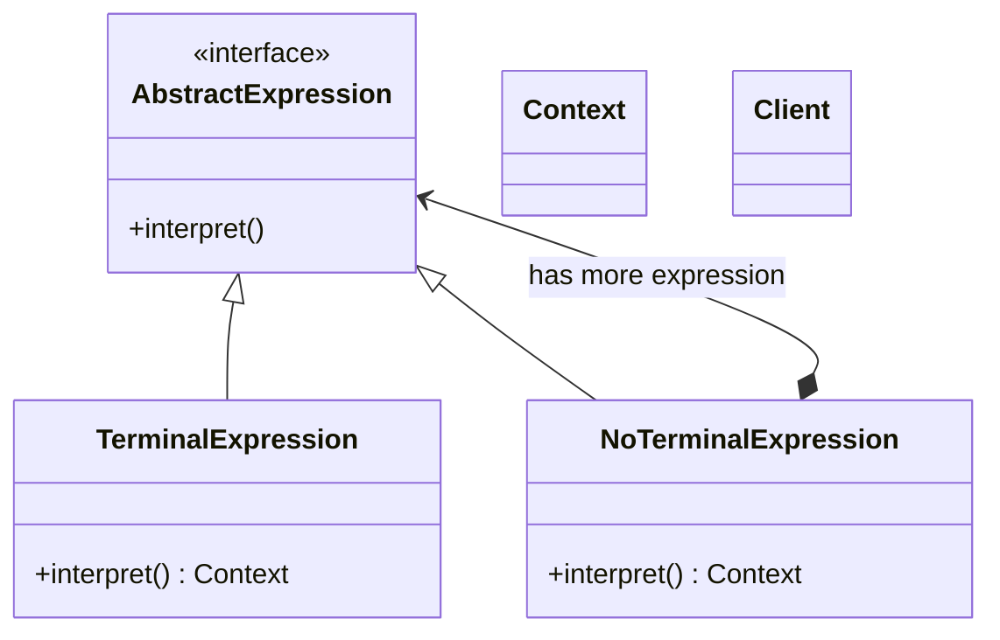

# 解释器模式 interpreter

## 动机
给定一个语言，定义它的文法的一种表示，并定义一个解释器，这个解释器使用该表示来解释语言中的句子。

## 定义
提供了评估语言的语法或表达式的方式。

## 结构
解释器模式包含如下角色:
- AbstractExpression抽象解释器类
- TerminalExpression具体解释器类
- NoTerminalExpression具体解释器类, 可以是多个
- Context上下文类, 被解释器解释的一个特定上下文

## 适用环境
- 对于一些固定文法, 构建一个解释句子的解释器
