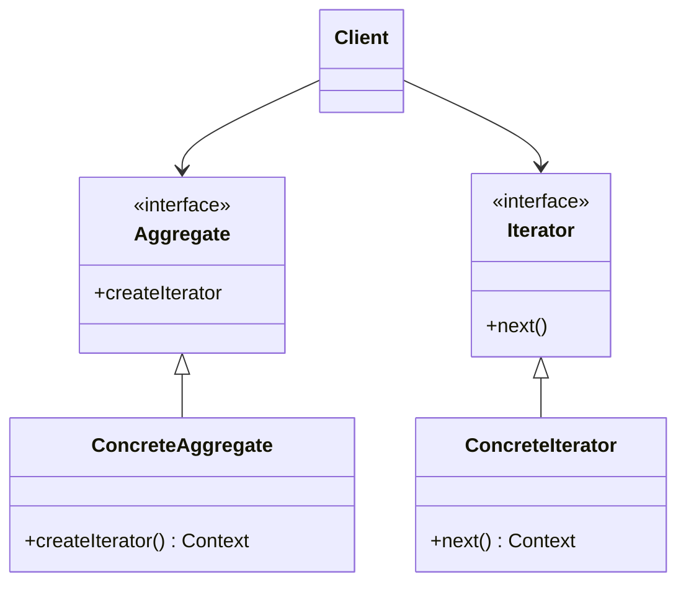

# 迭代器模式 iterator

## 动机 
提供一种方法顺序访问一个聚合对象中各个元素, 而又不需暴露该对象的内部表示。

## 定义
用于顺序访问集合对象的元素，不需要知道集合对象的底层表示。

## 结构
迭代器模式包含如下角色:
- Aggregate聚合抽象类
- ConcreteAggregate聚合具体类
- Iterator迭代抽象类
- ConcreteIterator迭代具体类

## 适用环境
- 不同的方式来遍历整个整合对象
- 为遍历不同的聚合结构提供一个统一的接口(即, 支持多态迭代)
