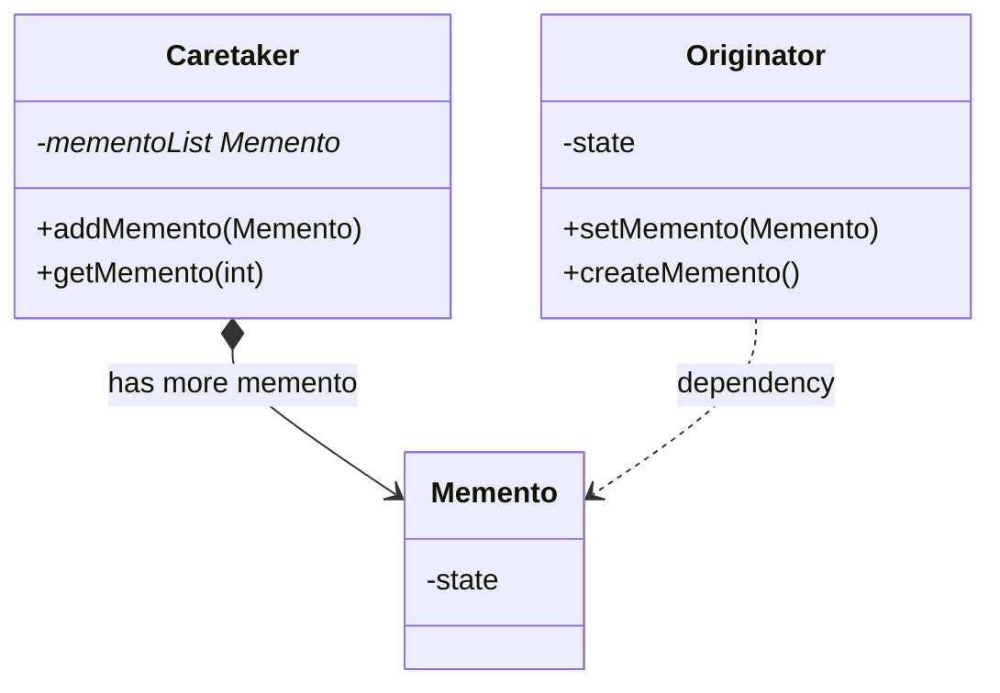

# 备忘录模式 memento

## 动机

## 定义

## 结构
备忘录模式包含如下角色：
- Memento备忘录类
- Originator类
- Caretaker类

```mermaid
classDiagram

class Caretaker{
  -mementoList Memento*
  +addMemento(Memento)
  +getMemento(int)
}

class Memento{
  -state
}

class Originator{
  -state
  +setMemento(Memento)
  +createMemento()
}

Caretaker *--> Memento : has more memento
Originator ..> Memento : dependency
```

## 适用环境

