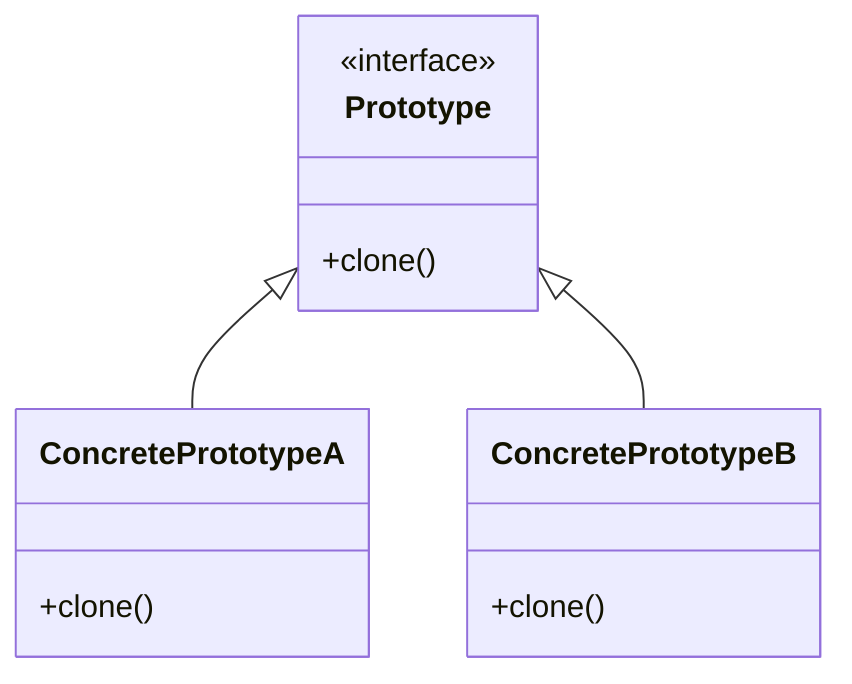

# 原型模式 prototype

## 动机

## 定义

用于创建重复的对象，同时又能保证性能。这种类型的设计模式属于创建型模式，它提供了一种创建对象的最佳方式。

## 结构

```mermaid
classDiagram

class Prototype{
  <<interface>>
  +clone()
}

class ConcretePrototypeA{
  +clone()
}

class ConcretePrototypeB{
  +clone()
}

Prototype <|-- ConcretePrototypeA
Prototype <|-- ConcretePrototypeB
```

## 适用环境

- 实现了一个原型接口，该接口用于创建当前对象的克隆。