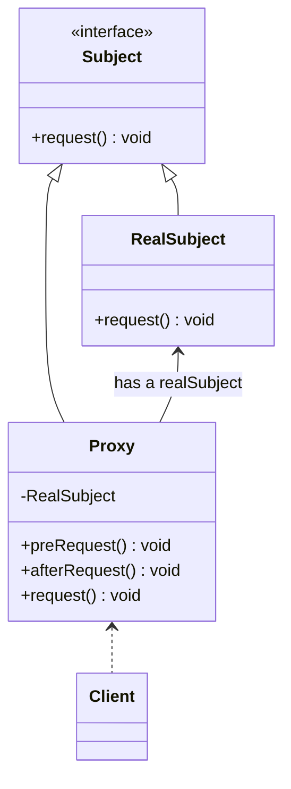

# 代理模式 proxy
## 动机
在某些情况下，一个客户不想或者不能直接引用一个对 象，此时可以通过一个称之为“代理”的第三者来实现 间接引用。代理对象可以在客户端和目标对象之间起到 中介的作用，并且可以通过代理对象去掉客户不能看到 的内容和服务或者添加客户需要的额外服务。

通过引入一个新的对象（如小图片和远程代理 对象）来实现对真实对象的操作或者将新的对 象作为真实对象的一个替身，这种实现机制即 为代理模式，通过引入代理对象来间接访问一 个对象，这就是代理模式的模式动机。

## 定义
给某一个对象提供一个代理，并由代理对象控制对原对象的引用。

## 结构
代理模式包含如下角色: Subject, Proxy, RealSubject

## 适用环境
根据代理模式的使用目的，常见的代理模式有以下几种类型：

- 远程(Remote)代理：为一个位于不同的地址空间的对象提供一个本地 的代理对象，这个不同的地址空间可以是在同一台主机中，也可是在 另一台主机中，远程代理又叫做大使(Ambassador)。
- 虚拟(Virtual)代理：如果需要创建一个资源消耗较大的对象，先创建一个消耗相对较小的对象来表示，真实对象只在需要时才会被真正创建。
- Copy-on-Write代理：它是虚拟代理的一种，把复制（克隆）操作延迟 到只有在客户端真正需要时才执行。一般来说，对象的深克隆是一个 开销较大的操作，Copy-on-Write代理可以让这个操作延迟，只有对象被用到的时候才被克隆。
- 保护(Protect or Access)代理：控制对一个对象的访问，可以给不同的用户提供不同级别的使用权限。
- 缓冲(Cache)代理：为某一个目标操作的结果提供临时的存储空间，以便多个客户端可以共享这些结果。
- 防火墙(Firewall)代理：保护目标不让恶意用户接近。
- 同步化(Synchronization)代理：使几个用户能够同时使用一个对象而没有冲突。
- 智能引用(Smart Reference)代理：当一个对象被引用时，提供一些额外的操作，如将此对象被调用的次数记录下来等。