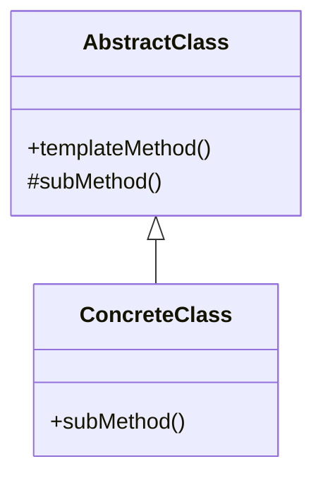

# 模板方法模式 template

## 动机

- 避免重复代码。

## 定义
定义了一个算法的骨架，而将一些步骤延迟到子类中，模版方法使得子类可以在不改变算法结构的情况下，重新定义算法的步骤。

## 结构
模板方法模式包含如下角色：
- AbstractClass抽象父类
- ConcreteClass具体子类

## 适用环境

- 一次性实现一个算法的不变的部分，并将可变的行为留给子类来实现。
- 各子类中公共的行为应被提取出来并集中到一个公共父类中以避免代码重复。
